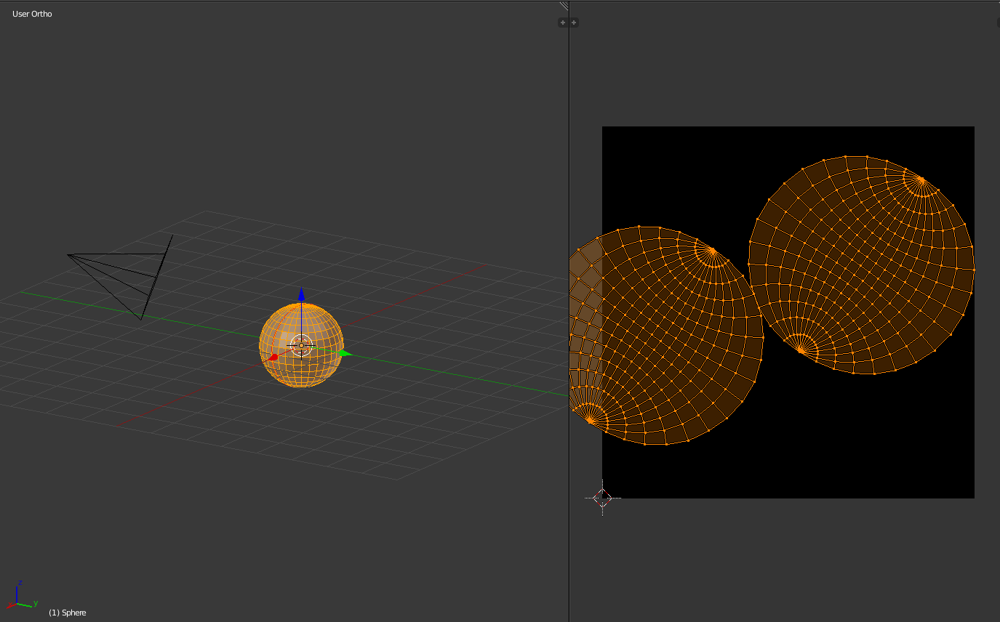
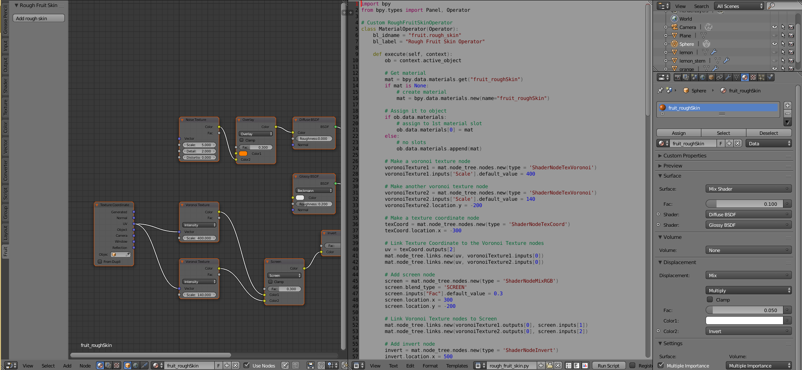

# RoughFruitSkin
This code is intended for Blender users who are looking to add citrus fruit material. In order for this code to work, you will need to be in Cycles Render and use Nodes for your material.
## Setting Up Your Object
For this example, I used a sphere. First you will need to unwrap your object. Of course, mark the seams that you deem appropriate before unwrapping.

## Running The Code
To see the code work, you need to have your Node Editor open along with your Text Editor. In your text editor, open `rough_fruit_skin.py`. Before running the code, make sure that:
<ul>
  <li> You are in Cycles Render. </li>
  <li> Your object is selected. </li>
  <li> Your material uses nodes. </li>
</ul>
Once you run the code via the text editor, you will see a new tab under the tools tab called "Fruit". Navigate to that tab and click "Add rough skin". This will automatically add the material to your selected object and the nodes for that material.

